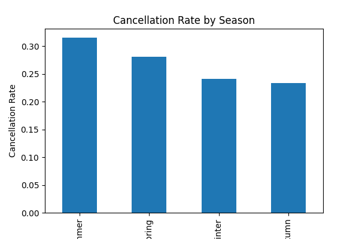
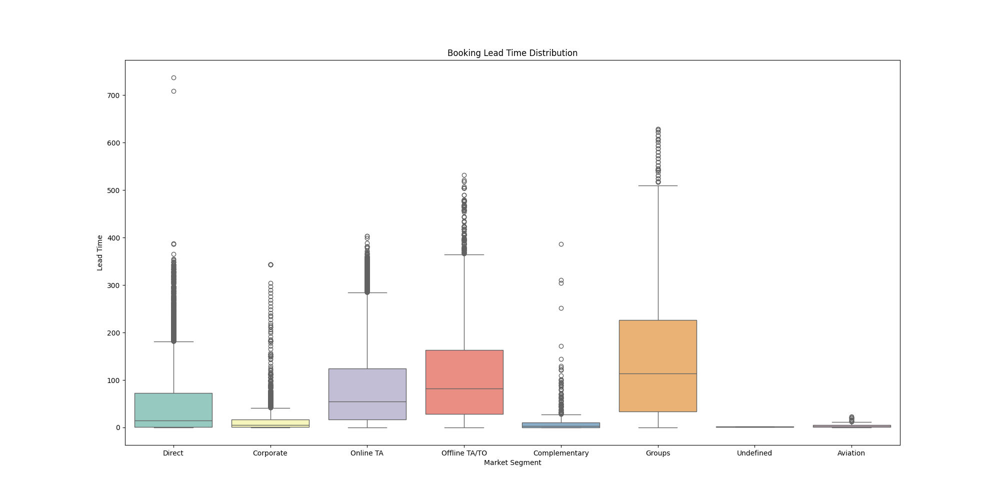

# Hotel Booking Demand Analysis

This project analyzes hotel booking data to understand patterns in reservations, cancellations, customer segments, and seasonal demand.  
The analysis uses **Exploratory Data Analysis (EDA)** techniques to identify trends that influence hotel occupancy and booking behavior.

The goal is to uncover insights that help hotels **optimize pricing, manage cancellations, and improve occupancy rates**.

---

## Dataset Summary

<table>
<tr>

<td>

### Dataset Metrics

| Metric | Value |
|------|------|
| Total Bookings | 119,390 |
| Total Features | 32 |
| Hotel Types | 2 |
| Customer Segments | 4 |

</td>

<td>

### Booking Distribution

| Hotel Type | Bookings |
|------|------|
| City Hotel | 79,330 |
| Resort Hotel | 40,060 |

</td>

<td>

### Cancellation Statistics

| Metric | Value |
|------|------|
| Total Cancellations | 44,224 |
| Cancellation Rate | 37% |

</td>

</tr>
</table>

---

## Key Dataset Features

| Feature | Description |
|------|------|
| hotel | Type of hotel (City or Resort) |
| is_canceled | Booking cancellation status |
| lead_time | Days between booking and arrival |
| arrival_date_month | Month of arrival |
| stays_in_weekend_nights | Weekend nights stayed |
| stays_in_week_nights | Weekday nights stayed |
| adults | Number of adults |
| children | Number of children |
| meal | Type of meal booked |
| country | Customer country |
| market_segment | Market segment type |
| distribution_channel | Booking distribution channel |
| previous_cancellations | Previous cancellations by customer |

---

## Booking Insights

<table>
<tr>

<td>

### Customer Segments

| Segment | Share |
|------|------|
| Online Travel Agents | ~47% |
| Direct Bookings | ~12% |
| Corporate | ~6% |
| Offline Agents | ~15% |

</td>

<td>

### Average Stay

| Metric | Value |
|------|------|
| Avg Weekend Nights | 0.93 |
| Avg Week Nights | 2.50 |
| Avg Total Stay | ~3.4 Nights |

</td>

<td>

### Lead Time

| Metric | Value |
|------|------|
| Avg Lead Time | 104 Days |
| Max Lead Time | 737 Days |

</td>

</tr>
</table>

---

## Exploratory Analysis

The project explores several important booking trends:

- Monthly booking demand patterns
- Hotel type booking distribution
- Cancellation behavior
- Customer market segments
- Average stay duration
- Lead time patterns

---

## Project Structure

```
Hotel-Booking-Analysis
│
├── Hotel_bookings.ipynb
├── screenshot1.png
├── screenshot2.png
├── screenshot3.png
├── screenshot4.png
├── screenshot5.png
├── screenshot6.png
└── README.md
```

---

## Data Visualizations

<table>
<tr>
<td align="center"><b>Hotel Booking Distribution</b></td>
<td align="center"><b>Monthly Booking Trends</b></td>
<td align="center"><b>Booking Cancellations</b></td>
</tr>

<tr>
<td></td>
<td></td>
<td></td>
</tr>

<tr>
<td align="center"><b>Market Segment Distribution</b></td>
<td align="center"><b>Average Stay Duration</b></td>
<td align="center"><b>Lead Time Distribution</b></td>
</tr>

<tr>
<td></td>
<td></td>
<td></td>
</tr>
</table>

---

## Key Insights

- **City hotels receive significantly more bookings than resort hotels**
- Nearly **37% of bookings are cancelled**
- Most bookings come through **online travel agents**
- Average stay duration is approximately **3–4 nights**
- Booking lead time averages **over 100 days**

---

## Author

Bhargav Kumar
