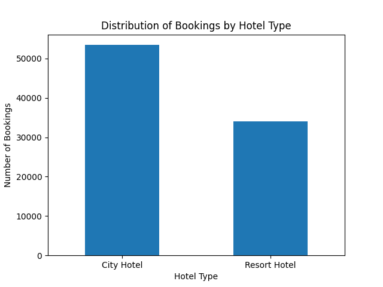
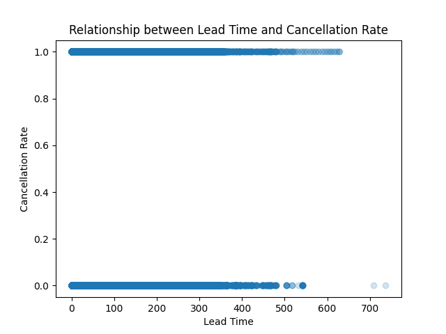
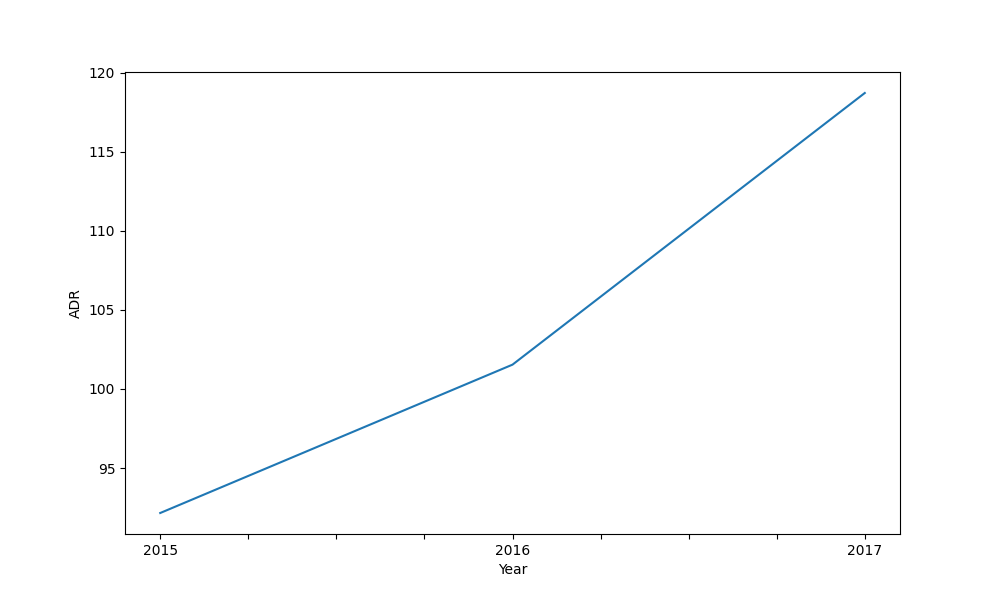
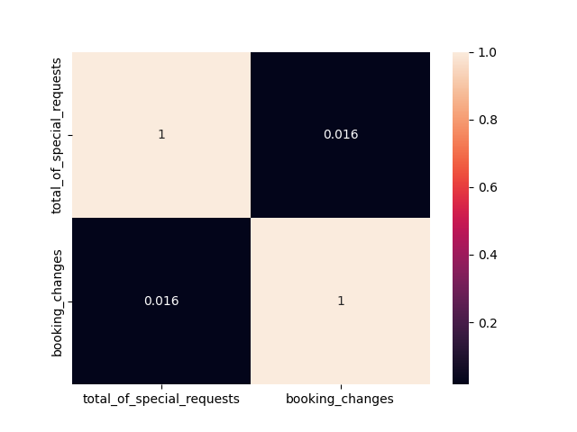

# App Insights Unlocked
### Google Play Store Data Analysis

This project performs **Exploratory Data Analysis (EDA)** on the Google Play Store dataset to identify trends in app performance, ratings, installs, and pricing.

The analysis highlights patterns related to **high-performing categories, user engagement, and pricing strategies** in the Play Store ecosystem.

---

## Overview

| Item | Details |
|-----|-----|
| Dataset | Google Play Store Apps |
| Total Apps | 10,841 |
| Total Features | 13 |
| Apps with Rating Data | 9,367 |
| Missing Ratings | 1,474 |
| Average Rating | 4.18 |

---

## Project Objectives

- Identify high-performing app categories  
- Analyze the relationship between **app size and ratings**  
- Study the impact of **pricing on reviews and installs**  
- Explore patterns in **user engagement and downloads**

---

## Dataset Information

### Dataset Columns

| Column |
|------|
| App |
| Category |
| Rating |
| Reviews |
| Size |
| Installs |
| Type |
| Price |
| Content Rating |
| Genres |
| Last Updated |
| Current Version |
| Android Version |

---

## Data Cleaning

The dataset required preprocessing before analysis.

### Missing Values

| Column | Missing Values |
|------|------|
| Rating | 1,474 |
| Type | 1 |
| Content Rating | 1 |
| Current Version | 8 |
| Android Version | 3 |

### Cleaning Steps

- Converted **Reviews** column to numeric  
- Cleaned **Installs** column by removing `+` and commas  
- Converted **Price** column to numeric  
- Converted **Last Updated** column to datetime  
- Removed **duplicate records**  
- Handled **missing values**

---

## App Type Distribution

| Type | Number of Apps |
|------|---------------|
| Free | 9,591 |
| Paid | 765 |

The Play Store is dominated by **free applications**.

---

## Exploratory Data Analysis

The analysis was conducted in three stages.

### 1. Basic Analysis

- Dataset overview
- Category distribution
- Rating distribution
- Free vs Paid app comparison

---

### 2. Intermediate Analysis

The following relationships were explored:

- Installs vs Ratings
- Category popularity
- App size vs rating relationship
- Review patterns across app types

#### Average Reviews by App Type

| Type | Average Reviews |
|------|---------------|
| Free | 437,373 |
| Paid | 11,900 |

Free apps receive significantly **more user engagement and reviews**.

---

### 3. Advanced Insights

#### Average App Size by Category

| Category | Avg Size (MB) |
|--------|-------------|
| GAME | 39.36 |
| FAMILY | 25.96 |
| SPORTS | 20.39 |
| PARENTING | 20.26 |
| TRAVEL_AND_LOCAL | 18.51 |

Game apps tend to have the **largest average file sizes**.

---

## High Install Apps

Examples of applications with **over 1 Billion installs** include:

- Google Drive
- Google Play Games
- Facebook
- Instagram

These applications dominate the platform in terms of **user engagement and downloads**.

---

## Project Structure

```
App-Insights-Analysis
│
├── App_Insights.ipynb
├── screenshot1.png
├── screenshot2.png
├── screenshot3.png
├── screenshot4.png
└── README.md
```

---

## Project Visualizations

The following visualizations were generated during the analysis:

- Category Distribution
- Rating Distribution
- Installs vs Rating Scatter Plot
- Trend of App Updates Over Time

```







```

---

## Key Insights

- Free apps represent **over 90% of Play Store applications**
- Free apps receive **significantly more reviews**
- Game applications tend to have the **largest file sizes**
- Most app ratings fall between **4.0 and 4.5**
- Several apps exceed **1 billion installs**

---

## Author

Bhargav Kumar
